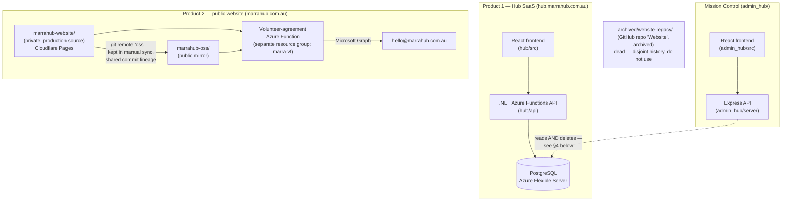

# Marra Community Hub — Ecosystem Overview

This document exists because the codebases in this folder look more related than they
actually are. Read this first, before opening any single project's own
`PROJECT_DOCUMENTATION.md` — it tells you which project is which, which one is live,
which one is dead, and how the pieces actually talk to each other.

There are **two separate products** under the "Marra Hub" name, plus one internal tool
and one dead repo. They do not share code, a database, or a hosting provider.

## 1. The map

| Local folder | GitHub repo | Visibility | Live at | What it is |
|---|---|---|---|---|
| `hub/` | `hub` | private | **hub.marrahub.com.au** | Product 1: the Hub SaaS — volunteer & workshop management, multi-tenant |
| `admin_hub/` | `admin_hub` | private | *(not public — internal only)* | "Mission Control": the platform owner's admin panel for Product 1 |
| `marrahub-website/` | `marrahub` | private | **marrahub.com.au** | Product 2: the public marketing website — **production source** |
| `marrahub-oss/` | `marrahub-oss` | public | *(same site, mirror source)* | Product 2's public open-source mirror |
| `_archived/website-legacy/` | `Website` | public, **archived** | — | Dead. A one-off 2026-06-18 snapshot, superseded. Do not use. |
| `_drafts/*` | none | — | — | Local prototypes, never pushed anywhere |
| `secrets/` | none | — | — | Credentials doc, deliberately kept outside every git repo |

Each of `hub/`, `admin_hub/`, `marrahub-website/`, `marrahub-oss/` now has its own full
`PROJECT_DOCUMENTATION.md` (16 sections, architecture diagrams, API tables, file maps,
etc.) written straight from their source code. This file is the map between them.

## 2. The two products, and why the names collide

Both products are branded "Marra Hub," which is the entire source of confusion:

- **Product 1 — the Hub SaaS** (`hub/`): what volunteers *use* to apply, RSVP to
  workshops, and what org admins use to manage them. A .NET 10 Azure Functions API +
  React frontend, backed by its own PostgreSQL database, hosted entirely on Azure
  (Static Web Apps + Functions). Lives at `hub.marrahub.com.au`.

- **Product 2 — the public website** (`marrahub-website/` / `marrahub-oss/`): the
  marketing site — About, Programs, Impact, Governance, Contact. A static React/Vite
  site with **no database**, hosted on Cloudflare Pages. Lives at `marrahub.com.au`.
  It has one small piece of server logic: a standalone Azure Function that emails a
  signed volunteer agreement PDF via Microsoft Graph — this is its own Azure resource
  group (`marra-vf`), completely unrelated to Product 1's Azure infrastructure.

They do not call each other, share a database, or share a codebase. A person applying
to volunteer on the *website* is a different flow from a person managing volunteers
inside the *Hub SaaS* dashboard.

## 3. How the pieces actually connect

**Hub SaaS ↔ Mission Control:** `admin_hub` connects directly to the Hub SaaS's
PostgreSQL database (same tables `hub`'s EF Core backend writes) using its own
`DATABASE_URL`. Its README calls this "read-only," but the code found by the
`admin_hub` documentation agent says otherwise — **see the security note in §4**.

**`marrahub-website` ↔ `marrahub-oss`:** these are two separate local checkouts of a
shared lineage, not a one-way export. `marrahub-website`'s git remote `origin` points
at the private `marrahub` repo (the Cloudflare deploy source); its second remote,
`oss`, points at the public `marrahub-oss` repo. Verified directly (not assumed from
docs): at the time of this audit, `origin/main`, `oss/main`, and the local `main` of
`marrahub-website` were all the *identical* commit — and `marrahub-oss`'s own tracked
source is byte-for-byte identical to it. The only things that differ between the two
folders are **untracked, gitignored files**: real secrets (`.env.local`,
`api/local.settings.json`) and local design-tooling build output (`.ds-sync/`,
`ds-bundle/`) that exist only in `marrahub-website`. Contrary to what both READMEs
imply, the OSS mirror is **not** a stripped-down/sanitized version of the code — the
Formspree contact form and Turnstile integration are in both repos' tracked source.

Right now `marrahub-oss`'s checkout is 1 commit ahead of `marrahub-website` on branch
`feat/home-redesign` (an in-progress aurora-background redesign) — that work has not
been merged back to the private repo yet.

**The volunteer-agreement Azure Function:** used by *both* website repos, but it is
its own deployment (`marra-vf` resource group), unrelated to the Hub SaaS's Azure
Functions app. Its live secrets are documented (names/purposes only, no values) in
`secrets/volunteer-form-secrets.md`, outside every git repo by design.

**The archived repo:** `_archived/website-legacy` (GitHub `Website`) shares no commit
history with either website repo. It was a one-time squashed snapshot from
2026-06-18, missing later features (e.g. the volunteer feature-flag work), and GitHub
confirms it's archived. It is not deployed anywhere and should not be used as a
reference.

## 4. Consolidated risk list (from all four deep-dives)

Ranked by what a volunteer or you should act on first — full detail is in each
project's own `PROJECT_DOCUMENTATION.md` §13:

| Priority | Project | Issue |
|---|---|---|
| High | `admin_hub` | README/task brief called this app "read-only" — it is not. `DELETE /api/orgs/:id` permanently cascades a delete across an organisation's data **and** its members' user accounts, gated only by one shared `ADMIN_PASSWORD`-derived session cookie, with only `console.log` as an audit trail. If this is intentional, it needs real auditing and probably a confirmation step; if it's not, it needs review. |
| High | `hub` | Production PostgreSQL uses plain password auth (broad `0.0.0.0` `AllowAzureServices` firewall rule, password stored as a plain Functions app setting + GitHub secret) — despite the project's own `docs/STACK.md` recommending Entra managed-identity + Key Vault instead. Worth migrating before user data scales further. |
| Medium | `hub` | 52 real API endpoints exist across 11 function classes; the README documents about 11 of them. A new developer (or volunteer) reading only the README will think the surface is much smaller than it is. |
| Medium | `hub` | README says signup immediately signs you in; the code actually requires email verification first and opens no session until then. |
| Medium | `marrahub-website` | Brand fonts (Inter / Ibarra Real Nova) are referenced in `theme.css` but never actually loaded anywhere (`fonts.css` is empty, `@fontsource` isn't a dependency) — production silently falls back to Georgia/system fonts. |
| Medium | `marrahub-oss` | `scripts/seo-build.mjs` duplicates site config instead of importing it from `src/app/seo/site.ts`, and the two have already drifted (they currently disagree on the org's phone number in prerendered SEO output vs. the live app). |
| Low | `marrahub-website` | CI checks aren't enforced as a merge gate on `main`, which auto-deploys to production on every push. |

## 5. Where to go next

- Working on volunteer/workshop features or the SaaS dashboard → `hub/PROJECT_DOCUMENTATION.md`
- Working on the internal admin panel → `admin_hub/PROJECT_DOCUMENTATION.md`
- Working on the public marketing site (the one deployed to marrahub.com.au) →
  `marrahub-website/PROJECT_DOCUMENTATION.md` — this is the repo to actually commit to
- Contributing to the public open-source copy → `marrahub-oss/PROJECT_DOCUMENTATION.md`
  — remember `feat/home-redesign` here hasn't been merged back to `marrahub-website` yet
- Anything in `_archived/` or `_drafts/` → not live, not deployed, safe to ignore unless
  you're specifically told to look there
