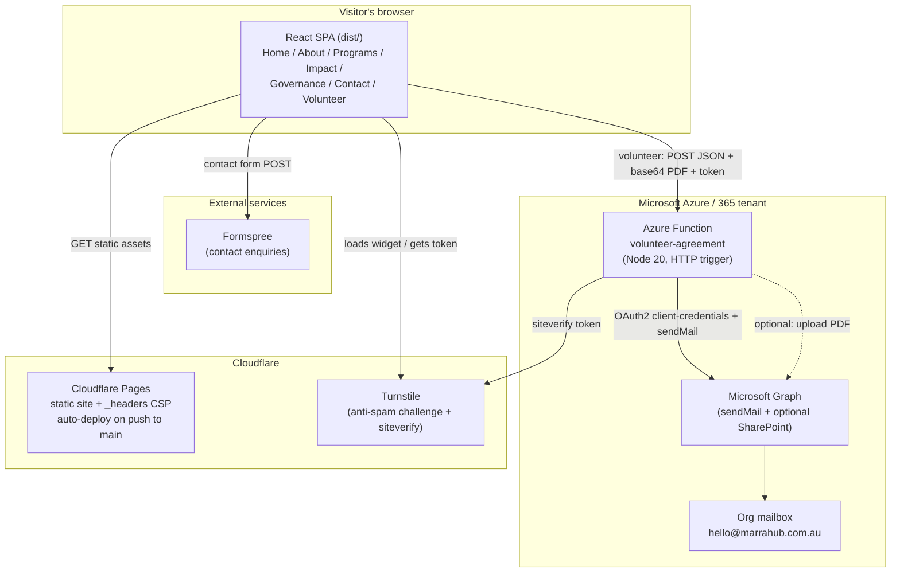
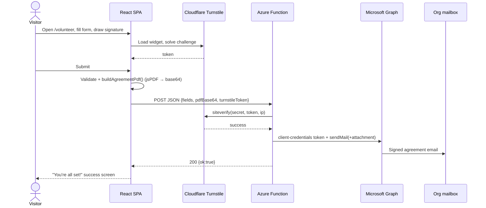

# Project Documentation

> **Project:** `marrahub-website` — the public marketing website for **MARRA Community Hub**
> **Live site:** [marrahub.com.au](https://marrahub.com.au)
> **Hosting:** Cloudflare Pages (auto-deploy on push to `main`)
> **License:** MIT © Marra Community Hub Incorporated
>
> This document was written from a full read of the source and configuration (not just the README). Where the README or a doc disagrees with the code, this is called out explicitly. Conclusions cite the file they came from.

---

## 1. Project overview

`marrahub-website` is the public-facing marketing site for **MARRA Community Hub**, a not-for-profit community centre being established in Caulfield South (Glen Eira, Victoria, Australia). The name "MARRA" is described on the site as inspired by an Aboriginal-language word for connection and helping hands (`src/app/pages/Home.tsx`, `src/app/pages/About.tsx`).

It is a **single-page application (SPA)**: a React + Vite app served as static files, with client-side routing and a small SEO prerender step at build time. There is **no application server and no database** — the site is entirely static except for two form integrations (see below).

What the site does (`README.md`, `src/app/routes.ts`):

- Presents the organisation: **Home, About, Programs, Impact, Governance, Contact** pages.
- Handles a **contact enquiry form** (submits to Formspree, protected by Cloudflare Turnstile).
- Handles an online **Volunteer Agreement** flow — read, fill, draw a signature, generate a signed PDF in the browser, and POST it to a backend (an **Azure Function**) that emails the signed PDF to the organisation via Microsoft Graph. This flow is **feature-flagged OFF in production** (`.env.production`, `src/app/featureFlags.ts`).
- Emits **SEO metadata** (per-route `<title>`/meta/OpenGraph/Twitter, JSON-LD structured data, `sitemap.xml`, `robots.txt`) both at runtime (`src/app/components/Seo.tsx`) and at build time (`scripts/seo-build.mjs`).

There are two additional, unusual concerns bundled into the repo that are **not part of the running website**:

1. A backend piece: `api/` — the Volunteer Agreement Azure Function (Section 6).
2. A design-system sync toolchain: `.design-sync/`, `.ds-sync/`, `ds-bundle/` — tooling that packages the site's React components and uploads them to a **claude.ai/design** project (Section 4 and Section 10).

> **Note on naming — two different products under one organisation.** This repo (`marrahub-website`, the public marketing site) is a **separate product** from the "Marra Hub" SaaS application that lives in sibling folders `hub/` and `admin_hub/` on this machine. They share the MARRA brand and organisation but are different codebases with different purposes. This document only covers `marrahub-website`. (There is a *planned* future "Marra Volunteer Portal" sketched in `docs/portal/SPEC.md`; the volunteer feature here is written to be portable to it — see Section 13.)

---

## 2. Project architecture

### 2.1 High-level shape

- **Frontend:** React 18 SPA, routed with React Router 7 (routes lazy-loaded / code-split), built by Vite 6, styled with Tailwind CSS 4 (CSS-variable design tokens), animated with Motion, icons from Lucide.
- **Static hosting:** Cloudflare Pages serves `dist/`. SPA deep-link handling and security headers are configured in `public/` (`404.html`, `_headers`). The Cloudflare Vite plugin + `wrangler` are used for local preview/deploy.
- **The one dynamic dependency (contact):** the Contact form POSTs to **Formspree** (`src/app/pages/Contact.tsx`).
- **The one backend piece (volunteer):** the Volunteer Agreement flow POSTs a JSON payload (form fields + a base64 PDF + a Turnstile token) to an **Azure Function** (`api/`), which verifies the token with Cloudflare and sends the signed PDF by email through **Microsoft Graph** (and optionally files it in SharePoint).

### 2.2 Relationship to `marrahub-oss` (verified against git, not guessed)

This working copy has **two git remotes** (`git -C marrahub-website remote -v`):

| Remote | URL | Visibility | Role |
|---|---|---|---|
| `origin` | `github.com/Marra-Community-Hub-Incorporated/marrahub.git` | **private** | The `marrahub` repository — the production origin. Cloudflare Pages auto-deploys from its `main`. `package.json.repository.url` also points here. |
| `oss` | `github.com/Marra-Community-Hub-Incorporated/marrahub-oss.git` | **public** | The `marrahub-oss` repository — the open-source public mirror of the same website. |

**Verified facts about how they relate:**

- `origin/main`, `oss/main`, and the local `main` are **the exact same commit** (`c3e9809…`), and they share a **single common history of 51 commits from one root commit** (`61c9b79 "Initial commit"`). `git merge-base origin/main oss/main` = the tip itself; `git log origin/main ^oss/main` and the reverse are both **empty**. In other words, the two GitHub repositories are the **same lineage** — one history pushed to two remotes — and were identical at the time of writing.
- The sibling folder `/Users/trysudo/Documents/Marra_Community_Hub_inc/marrahub-oss` is a **separate local checkout of the `marrahub-oss` remote** (its only remote `origin` = `…/marrahub-oss.git`; same root commit `61c9b79`). At the time of writing it is checked out on branch `feat/home-redesign`, **one work-in-progress commit ahead** of the shared `main` (`6659707 "Redesign home page with aurora background and updated typography"`), which is not yet on either `main`.
- Branch topology differs slightly between the two remotes: `origin` carries `chore/codeowners` and `docs/enforce-pr-review`; `oss` carries `chore/codeowners`, `feat/home-redesign`, and a **`docs/promotion-workflow`** branch whose single extra commit is titled *"Document how reviewed changes here get promoted to production"*. This is consistent with a workflow where changes are reviewed and then **promoted** between the two repos.

**In plain terms:** `marrahub-website` is the primary working copy, wired to push the same history to **both** the private `marrahub` repo (`origin`, the deploy source) and the public `marrahub-oss` repo (`oss`). The sibling `marrahub-oss/` folder is an independent checkout of the public repo, currently carrying one un-merged redesign commit. The tracked source is the same in both repos; the only real difference is the untracked/git-ignored content present here but absent from the public mirror (real secrets in `.env.local` and `api/local.settings.json`, and the machine-local design-sync engine/output).

> ⚠️ **Doc/reality inconsistency (confirmed):** `CONTRIBUTING.md` tells contributors to `git clone …/marrahub.git` — but that is the **private** `origin` repo, which external contributors cannot access. The public mirror is `marrahub-oss`. Update `CONTRIBUTING.md` (and any other public-facing clone instruction) to point at `marrahub-oss.git`.

### 2.3 Request-path diagram



---

## 3. Technologies used

Versions taken from `package.json` (site) and `api/package.json` (backend).

| Area | Technology | Version / notes | Where |
|---|---|---|---|
| UI library | React + React DOM | 18.3.1 | `package.json` |
| Routing | React Router | ^7.13.0 (`createBrowserRouter`, lazy routes) | `src/app/routes.ts` |
| Build tool | Vite | 6.4.3 (pinned via pnpm override too) | `vite.config.ts`, `package.json` |
| Language | TypeScript | ~5.6, `strict: true`, bundler mode, `noEmit` | `tsconfig.json` |
| Styling | Tailwind CSS | 4.1.12 via `@tailwindcss/vite`; CSS-variable tokens | `src/styles/*`, `postcss.config.mjs` |
| Animation | Motion (`motion/react`) | 12.23.24 | pages/components |
| Icons | `lucide-react` | 0.487.0 | pages/components |
| PDF generation | `jspdf` | ^4.2.1 (dynamically imported) | `src/app/features/volunteer-agreement/buildAgreementPdf.ts` |
| Tailwind animations | `tw-animate-css` | 1.3.8 | `src/styles/tailwind.css` |
| Hosting / edge | Cloudflare Pages + Wrangler | `wrangler` ^4.105.0, `@cloudflare/vite-plugin` | `wrangler.jsonc`, `vite.config.ts` |
| Anti-spam | Cloudflare Turnstile | site key public; secret server-side | `Contact.tsx`, `features/.../useTurnstile.ts`, `api/src/lib/turnstile.js` |
| Contact backend | Formspree | endpoint `formspree.io/f/xreavvnv` | `Contact.tsx` |
| Volunteer backend | Azure Functions | `@azure/functions` ^4.5.0, Node ≥20 | `api/` |
| Email delivery | Microsoft Graph (client-credentials) | no SDK; global `fetch` | `api/src/lib/graph.js` |
| Lint / format | ESLint 9 (flat config) + Prettier 3 | `eslint-config-prettier` last | `eslint.config.js`, `.prettierrc.json` |
| Secret scanning | gitleaks | v8.18.4 in CI, `.gitleaks.toml` allowlist | `.github/workflows/ci.yml` |
| CI | GitHub Actions | secret-scan + website build + API checks | `.github/workflows/ci.yml`, `docs/CI.md` |
| Design-system sync | esbuild, ts-morph, Playwright | staged locally in `.ds-sync/` (not committed) | `.design-sync/`, `.ds-sync/`, `ds-bundle/` |

Node used in CI is **22**; the README/CONTRIBUTING state a **Node 18+** minimum; the API requires **Node ≥20** (`api/package.json` engines).

---

## 4. File and folder structure

Top-level layout (`ls` at repo root), with the design-system tooling explained.

| Path | Committed? | Purpose |
|---|---|---|
| `index.html` | ✅ | Vite HTML entry. Contains the static SEO `<head>` block (between `SEO_HEAD_START/END` markers, rewritten at build) and the **inline SPA-redirect script** allowed by a CSP sha256 hash. |
| `src/main.tsx` | ✅ | App entry — mounts `<App/>` into `#root`, imports `styles/index.css`. |
| `src/app/App.tsx` | ✅ | Renders `<RouterProvider>`. |
| `src/app/routes.ts` | ✅ | `createBrowserRouter` route table; every page lazy-loaded; volunteer route conditional on the feature flag. |
| `src/app/Layout.tsx` | ✅ | Shared shell: `<Seo/>` + `<Header/>` + `<Outlet/>` + `<Footer/>`; scroll-to-top on route change. |
| `src/app/featureFlags.ts` | ✅ | `volunteer` flag: on in dev, off in prod unless `VITE_VOLUNTEER_ENABLED=true`. |
| `src/app/pages/` | ✅ | `Home, About, Programs, Impact, Governance, Contact, NotFound`. |
| `src/app/components/` | ✅ | `Button, Header, Footer, SectionHeader, ProgramCard, ImpactCard, CTABanner, Seo`. |
| `src/app/features/volunteer-agreement/` | ✅ | Self-contained volunteer flow (page, signature pad, PDF builder, Turnstile hook, submit seam, types, config, agreement text). |
| `src/app/seo/site.ts` | ✅ | Runtime SEO config + per-route metadata map + helpers. |
| `src/styles/` | ✅ | `index.css` (imports), `tailwind.css` (Tailwind v4 entry), `theme.css` (tokens/colors/type), `fonts.css` (**empty**). |
| `scripts/seo-build.mjs` | ✅ | Post-build: rewrites per-route `<head>`, writes prerendered `about/index.html` etc., `sitemap.xml`, `robots.txt`. |
| `public/` | ✅ | `_headers` (CSP + caching), `404.html` (SPA deep-link fallback), `robots.txt`, `.well-known/security.txt`, `media/` (favicons, hero/bg images, `Seo_Prev.png`), the blank `Marra_Hub_Volunteer_Agreement.pdf`. |
| `api/` | ✅ | Azure Function backend (Section 6). |
| `docs/` | ✅ | `CI.md` (branch-protection guide), `portal/SPEC.md` + `redesign-concept.html` (future portal design docs). |
| `guidelines/Guidelines.md` | ✅ | Placeholder template only (Figma Make scaffolding; no real rules). |
| `.github/workflows/ci.yml` | ✅ | CI pipeline. |
| `index.html`, `vite.config.ts`, `tsconfig.json`, `wrangler.jsonc`, `eslint.config.js`, `.prettierrc.json`, `.gitleaks.toml`, `.env.*` | ✅ | Build/tool config (Section 10). |
| `dist/` | ❌ (gitignored) | Local build output. Present here but stale in places (see Section 12). |
| `node_modules/`, `.wrangler/`, `.claude/` | ❌ | Machine-local. |

### 4.1 The design-system sync tooling (`.design-sync/`, `.ds-sync/`, `ds-bundle/`)

These three sibling directories are a **component-publishing pipeline**, not part of the website's runtime or its Cloudflare build. Their job: take the site's own React components, bundle them into a single self-contained browser package, verify each renders faithfully, and **upload that package to a claude.ai/design project** so a design agent can build new UIs from the real MARRA components. (`.design-sync/config.json` carries a `projectId`; `.design-sync/conventions.md` / `ds-bundle/README.md` are the "how to build with this design system" guides that ship with the bundle.)

| Directory | Committed? | What it is |
|---|---|---|
| **`.design-sync/`** | ✅ (durable inputs) | The committed, human-authored inputs to the sync. Key files: `config.json` (the sync manifest — `projectId`, `shape:"package"`, `globalName:"MarraHub"`, `componentSrcMap` for the 7 components, hand-written prop contracts in `dtsPropsFor`, `overrides`), `conventions.md` (design-system usage guide → README header), `NOTES.md` (repo-specific gotchas + "Re-sync risks"), `ds-entry.ts` (a **synthetic barrel** re-exporting the 7 components — this repo is a Vite app, not a library, so there is no natural entry point), `ds-extras.tsx` (a `PreviewRouter` = `MemoryRouter` shim so router-dependent components render in isolation), `brand-fonts.css` (a Google-Fonts `@import` used **only** for the design-system previews), `previews/*.tsx` (authored per-component preview files). `.design-sync/.cache/`, `learnings/`, `compiled.css`, `node_modules` are **gitignored**. |
| **`.ds-sync/`** | ❌ (gitignored) | The **converter engine itself**, staged locally per machine: `resync.mjs` (driver), `package-build.mjs` / `package-validate.mjs` / `package-capture.mjs`, `lib/*.mjs` (adapters: bundling, CSS scraping, dts extraction, story import resolution, previews, remote diff, etc.), `storybook/` (`compare.mjs` screenshot/grade harness, `probe.mjs`, `SKILL.md` operational manual). Its own deps (`esbuild`, `ts-morph`, `playwright`, `@types/react`) are installed in isolation so the repo lockfile is untouched. Not committed — recreated on each machine. |
| **`ds-bundle/`** | ❌ (gitignored) | The **build output** — the uploadable design-system package. `_ds_bundle.js` / `_ds_bundle.css` (all 7 components under `window.MarraHub`), `styles.css` (single stylesheet entry), `README.md`, per-component `components/**/<Name>.{d.ts,prompt.md,html}`, `tokens/`, `_vendor/` (React), `_preview/` (compiled previews), `_screenshots/`, `media/`, plus state files (`_ds_sync.json` sync anchor, `.resync-verdict.json`, `.ds-build-meta.json`, `.render-check.json`, `.sync-diff.json`, `.stories-map.json`, `_ds_needs_recompile`). Regenerated by the engine. |

**Managed components (7):** `Button`, `CTABanner`, `Footer`, `Header`, `ImpactCard`, `ProgramCard`, `SectionHeader` (`.design-sync/config.json` → `componentSrcMap`, `ds-entry.ts`). `Seo` is intentionally excluded (it is a non-visual head manager — `NOTES.md`).

**How it runs (from `.ds-sync/storybook/SKILL.md` + `NOTES.md`):** build the components with `npx vite build` (the site's own build; `config.json.buildCmd`); the converter bundles the barrel entry into a browser global, scrapes the compiled Tailwind CSS into `.design-sync/compiled.css` (fonts prepended from `brand-fonts.css`), generates a preview + a `.d.ts` prop contract per component, screenshots each preview and compares it side-by-side against a reference render, and grades fidelity (`match`/`close`/`mismatch`); results accumulate in `.design-sync/.cache/` (`review/*.json` grades, `upload-manifest.txt`); a driver run then uploads the verified `ds-bundle/` to the claude.ai/design project. **Only the durable inputs under `.design-sync/` are committed** — the engine and the output are machine-local.

> The site builds and deploys with **zero involvement** from this tooling. It can be ignored entirely for normal website work.

---

## 5. Running the project

### 5.1 Requirements

- **Node.js** — README/CONTRIBUTING say **18+**; CI uses **22**; the API needs **≥20**. Recommend Node **20 or 22** to cover everything.
- **npm** (repo ships `package-lock.json`; `npm ci` is used in CI).
- For local **volunteer backend** work: **Azure Functions Core Tools v4** and access to a Microsoft 365 tenant (`api/README.md`). Not needed for normal frontend work.
- For the **design-system sync**: esbuild/ts-morph/Playwright (+ chromium), installed into `.ds-sync/`. Not needed for normal work.

### 5.2 Installing dependencies

```bash
# website
npm install

# volunteer backend (only if you work on it)
cd api && npm install
```

### 5.3 Environment variables

All browser-facing values are `VITE_`-prefixed and **baked into the public bundle** — they are public by design and must never hold secrets (`README.md`, `.env.example`). Backend secrets live only in Azure app settings and a git-ignored local file (Section 6).

**Website (`VITE_*`, from `.env.example` / `.env.production` / `.env.local`):**

| Variable | Purpose | Notes |
|---|---|---|
| `VITE_SITE_URL` | Canonical site URL for SEO/sitemap. | `https://marrahub.com.au` in prod; used by `scripts/seo-build.mjs`. |
| `VITE_VOLUNTEER_API_URL` | Endpoint the volunteer flow POSTs to (the Azure Function URL). | Local default `http://localhost:7071/api/volunteer-agreement`. Public value. |
| `VITE_TURNSTILE_SITE_KEY` | Cloudflare Turnstile **site** key. | Public by design; falls back to the existing MARRA key if unset. |
| `VITE_VOLUNTEER_ENABLED` | Feature flag for the public volunteer flow. | Unset ⇒ on in dev, off in prod. `.env.production` sets it `false`. |

**Backend (Azure Function app settings — names only, no values; from `api/local.settings.json.example`, `api/README.md`):**

| Setting | Purpose |
|---|---|
| `TENANT_ID` | Microsoft Entra directory (tenant) ID. |
| `CLIENT_ID` | Entra app-registration application (client) ID. |
| `CLIENT_SECRET` | Entra app-registration client **secret** (the sensitive credential). |
| `GRAPH_SENDER` | Mailbox the signed-agreement email is sent **from**. |
| `NOTIFY_RECIPIENT` | Where signed agreements are delivered (comma-separated for several). |
| `TURNSTILE_SECRET` | Cloudflare Turnstile **secret** key (server-side verification). Blank ⇒ spam check skipped. |
| `ALLOWED_ORIGINS` | CORS allowlist for the function. |
| `CONFIRMATION_EMAIL_ENABLED` | If not `"false"`, also emails the volunteer a thank-you copy. |
| `SHAREPOINT_ENABLED` / `SHAREPOINT_SITE_ID` / `SHAREPOINT_FOLDER` | Optional SharePoint filing of the PDF. |
| `AzureWebJobsStorage`, `FUNCTIONS_WORKER_RUNTIME` | Azure Functions host settings. |

> **Secrets handling (important for external contributors):** No real secrets are committed. `api/local.settings.json` is **git-ignored** (verified via `git check-ignore`) and holds the real local values; the deployed function reads its values from Azure app settings. A file `secrets/volunteer-form-secrets.md` exists **outside this repo** and holds the real credential values — do not copy any of them into this repo or any doc. Only variable **names and purposes** belong in documentation.

### 5.4 Running locally

```bash
npm run dev        # Vite dev server + HMR (volunteer flow is ON in dev by default)
```

To exercise the volunteer flow end-to-end locally, also run the backend (`cd api && npm start`, serves `http://localhost:7071/api/volunteer-agreement`) and point `VITE_VOLUNTEER_API_URL` at it in `.env.local` (`api/README.md`).

npm scripts (`package.json`):

| Script | Command | Purpose |
|---|---|---|
| `dev` | `vite` | Dev server. |
| `build` | `vite build && node scripts/seo-build.mjs` | Production build + SEO prerender/sitemap. |
| `preview` | `npm run build && wrangler dev` | Build then serve via Wrangler (Cloudflare-accurate preview). |
| `deploy` | `npm run build && wrangler deploy` | Build + deploy via Wrangler (normally deploys happen automatically via Pages). |
| `typecheck` | `tsc --noEmit` | Type check. |
| `lint` | `eslint .` | Lint. |
| `format` / `format:check` | `prettier --write .` / `--check .` | Format. |

### 5.5 Running in production (Cloudflare Pages)

- **Build command:** `npm run build`
- **Output directory:** `dist`
- **Deploy trigger:** push to `main` on the `origin` repo (`README.md`, `docs/CI.md`).
- Production `VITE_*` values come from `.env.production` (committed, public values), so no Pages build variables are strictly required; additional overrides can be set in Pages → Settings → Environment variables.
- Security/cache headers ship via `public/_headers`; SPA deep links resolve via `wrangler.jsonc` (`not_found_handling: single-page-application`) and the `public/404.html` fallback.

---

## 6. Backend (the Volunteer Agreement Azure Function)

The **only** backend piece in this repo is `api/` — a single HTTP-triggered Azure Function (`@azure/functions` v4 programming model, Node ≥20). It receives a signed Volunteer Agreement from the website and delivers it inside the organisation's Microsoft 365 tenant, so signed personal data never touches a third-party form service (`api/README.md`).

### 6.1 Main modules

| File | Responsibility |
|---|---|
| `api/src/functions/volunteerAgreement.js` | The HTTP function: CORS, validation, Turnstile check, orchestration (email → optional SharePoint), email HTML builders. |
| `api/src/lib/graph.js` | Microsoft Graph helpers via OAuth2 **client-credentials** (app-only): `getGraphToken`, `sendMailWithAttachment`, `uploadToSharePoint`. No SDK — uses global `fetch`. |
| `api/src/lib/turnstile.js` | `verifyTurnstile` — server-side POST to Cloudflare `siteverify`. |
| `api/host.json` | Functions host config (v2.0, App Insights sampling, extension bundle `[4.*,5.0.0)`). |
| `api/package.json` | Deps (`@azure/functions`), scripts (`func start`, `func azure functionapp publish`). |
| `api/local.settings.json.example` | Template of app settings (copied to the git-ignored `local.settings.json`). |
| `api/README.md` | Full one-time setup: Entra app registration, `Mail.Send` (+ optional `Sites.ReadWrite.All`) with admin consent, deploy, CSP update. |

### 6.2 API endpoints

| Method | Route | Auth | Body | Success | Errors |
|---|---|---|---|---|---|
| `OPTIONS` | `/api/volunteer-agreement` | anonymous | — | `204` + CORS headers | — |
| `POST` | `/api/volunteer-agreement` | anonymous | JSON matching `VolunteerAgreementSubmission` (`src/app/features/volunteer-agreement/types.ts`) | `200 { ok: true }` | `400` invalid JSON / missing field / failed Turnstile; `413` attachment > ~8 MB; `500` Graph token/config error; `502` email send failed |

Required fields validated server-side (`volunteerAgreement.js`): `fullName, email, phone, area, emergencyContact, dietary, signedName, pdfBase64` (each must be a non-empty string). `pdfBase64` is capped at ~8 MB encoded.

The website's `types.ts` is the shared source of truth for the payload shape; `api/README.md` explicitly notes this contract is what a future "Hub SaaS" would reuse by re-pointing `VITE_VOLUNTEER_API_URL`.

### 6.3 Business logic

Flow inside the handler (`volunteerAgreement.js`):

1. Short-circuit `OPTIONS` (CORS preflight). CORS origin is chosen from `ALLOWED_ORIGINS` (falls back to `*` if unset).
2. Parse JSON; validate required string fields; enforce PDF size cap.
3. **Spam check (conditional):** only if `TURNSTILE_SECRET` is set — verify `turnstileToken` with Cloudflare, passing the client IP (`cf-connecting-ip` / `x-forwarded-for`). Failure ⇒ `400`.
4. Acquire a Graph token (client-credentials).
5. **Email #1 (always):** send the signed PDF as an attachment to `NOTIFY_RECIPIENT` (or `GRAPH_SENDER`) with an HTML summary table of the submission.
6. **Email #2 (non-fatal, unless `CONFIRMATION_EMAIL_ENABLED="false"`):** send the volunteer a branded thank-you email with their signed agreement attached. Failure is logged but does not fail the request.
7. **SharePoint (optional, non-fatal):** if `SHAREPOINT_ENABLED="true"`, upload the PDF to the configured site/library.
8. Return `200 { ok: true }`.

All interpolated values in email HTML are escaped (`esc()`), mitigating HTML injection into the notification/confirmation emails.

### 6.4 Error handling

- Client input errors return specific `4xx` JSON `{ error }` messages the frontend surfaces to the user (`submitAgreement.ts` reads `data.error`).
- Graph token failure ⇒ `500` "Server email configuration error."; primary send failure ⇒ `502` "Could not send the agreement email." (both `context.error`-logged).
- Confirmation email and SharePoint upload failures are **swallowed** (logged, non-fatal) because the organisation has already received the record via Email #1 — a deliberate design choice noted in code comments.
- `graph.js` throws early on any missing required env var (`requireEnv`).

### 6.5 Background tasks, workers, and queues

**None.** The function is a single synchronous HTTP request/response. No timers, queues, durable functions, or background workers. (The website itself likewise has no workers; the only "background-ish" pieces are the browser-side Turnstile widget load and the dynamic `jspdf` import.)

---

## 7. Frontend

### 7.1 Interface structure (pages)

Routes are defined in `src/app/routes.ts`; per-page SEO metadata in `src/app/seo/site.ts` and `scripts/seo-build.mjs`.

| Route | Component | Content (verified from source) |
|---|---|---|
| `/` | `pages/Home.tsx` | Hero (background image + curved SVG divider), "Why MARRA", 6 program cards, roadmap impact cards, governance preview, location, CTA banner. Hero secondary CTA and links switch between `/volunteer` and `/contact` based on the feature flag. |
| `/about` | `pages/About.tsx` | Name meaning, the MARRA story, mission & values, who we serve. |
| `/programs` | `pages/Programs.tsx` | Core services (6 program cards) + extended services (arts, employment, housing, financial literacy, social groups, volunteer/leadership training) + "how people join" + CTA. |
| `/impact` | `pages/Impact.tsx` | Early impact focus, areas of impact, community partnerships, long-term vision, CTA. |
| `/governance` | `pages/Governance.tsx` | Organisational governance, safeguarding & protection, ethical commitments, accountability & reporting (anchors `#safeguarding`, `#accountability` linked from the footer). |
| `/contact` | `pages/Contact.tsx` | Contact details, **Formspree enquiry form** + Turnstile, accessibility info (`#accessibility`), service areas, crisis hotlines. |
| `/volunteer` | `features/volunteer-agreement/VolunteerAgreementPage.tsx` | Volunteer Agreement form + signature pad + Turnstile → generates PDF → POSTs to the Azure Function. **Only mounted when the flag is on;** otherwise the route `redirect`s to `/contact`. |
| `*` | `pages/NotFound.tsx` | 404 page with a link home (SEO `noindex`). |

### 7.2 Main components

| Component | File | Purpose |
|---|---|---|
| `Layout` | `app/Layout.tsx` | Page shell (SEO + header + outlet + footer), scroll reset. |
| `Header` | `components/Header.tsx` | Sticky nav; mobile menu; nav items and CTA switch on the volunteer flag; active-link styling. |
| `Footer` | `components/Footer.tsx` | Brand blurb, quick links, contact block, transparency links, ABN, acknowledgement of Traditional Owners. |
| `Button` | `components/Button.tsx` | Polymorphic button: internal `href`→`<Link>`, external `http(s)`→new-tab `<a>`, else `<button>`; `primary/secondary/outline` × `sm/md/lg`. |
| `SectionHeader` | `components/SectionHeader.tsx` | Eyebrow + serif title + description, left/center. |
| `ProgramCard` | `components/ProgramCard.tsx` | Icon + title + description + optional "Expected Outcomes" list. |
| `ImpactCard` | `components/ImpactCard.tsx` | Big stat (or icon) + label + description. |
| `CTABanner` | `components/CTABanner.tsx` | Call-to-action panel with primary/secondary buttons; `default`/`muted`. |
| `Seo` | `components/Seo.tsx` | Runtime `<head>` manager — updates title/meta/OG/Twitter/canonical + injects JSON-LD (`Organization`/NGO, `WebSite`, `WebPage`, breadcrumbs) on route change. |
| Volunteer feature | `features/volunteer-agreement/*` | `VolunteerAgreementPage` (form + success screen), `SignaturePad` (dependency-free canvas → PNG data URL), `buildAgreementPdf` (jsPDF, dynamic import), `useTurnstile` (widget hook), `submitAgreement` (the single network seam), `agreementContent` (21 clauses transcribed from the official PDF), `types`, `config`. |

The 7 non-`Seo` components double as the "MarraHub" design system published by the sync tooling (Section 4.1).

### 7.3 Talking to the API

There are **two independent submission paths**, plus a shared anti-spam layer:

1. **Contact enquiries → Formspree.** `Contact.tsx` POSTs `FormData` to `https://formspree.io/f/xreavvnv` with a `cf-turnstile-response` token. Turnstile is loaded/rendered inline in `Contact.tsx` (its own copy of the widget logic).
2. **Volunteer agreements → Azure Function.** `submitAgreement.ts` POSTs the JSON `VolunteerAgreementSubmission` to `VITE_VOLUNTEER_API_URL`. This is deliberately the **only** network seam for the feature (comment: to migrate to a different backend, just re-point the env var). The Turnstile token is generated by the `useTurnstile` hook and verified server-side by the function.
3. **Cloudflare Turnstile** underpins both: the widget script loads from `challenges.cloudflare.com`; the browser obtains a token; verification happens either at Formspree (contact) or in the Azure Function via `siteverify` (volunteer). The site key is public; the secret key is server-side only.

> Note: Turnstile widget logic exists in **two places** — inline in `Contact.tsx` and as the reusable `useTurnstile` hook in the volunteer feature. The volunteer feature refactored it into a hook; the Contact page still carries an inline copy (minor duplication — Section 13).

### 7.4 Application state

State is **local and ephemeral** — React `useState`/`useRef` within components. There is no global store (no Redux/Zustand/Context data store), no client-side persistence, and no data fetching/caching layer. Forms hold their own state; the volunteer feature tracks `formData`, `agreed`, `signatureImage`, and a small `formStatus` state machine (`idle → submitting → success | error`). Routing state is React Router's; SEO is applied as a side effect on `location.pathname` change.

### 7.5 Accessibility and keyboard interaction

Keyboard interaction is one of the key component contracts. Interactive controls should remain reachable without a pointer, modal focus should not escape to the page behind it, and composite widgets use the expected keyboard navigation pattern.

| Component / pattern | Key | Expected behaviour |
|---|---|---|
| Skip to main content | `Tab` | Skip link as the first keyboard-accessible control on initial page entry. |
| Skip to main content | `Enter` | Moves focus to the main page content. |
| Event announcement dialog (`Home.tsx`) | `Tab` | Moves forward through focusable controls and wraps from the last control back to the first. |
| Event announcement dialog (`Home.tsx`) | `Shift + Tab` | Moves backward through focusable controls and wraps from the first control to the last. |
| Event announcement dialog (`Home.tsx`) | `Escape` | Closes the dialog. |
| Event announcement dialog (`Home.tsx`) | `Enter` / `Space` | Activates the focused button or link using its native keyboard behaviour. |
| Mobile navigation (`Header.tsx`) | `Enter` / `Space` | Opens or closes the mobile navigation from the menu button. |
| Mobile navigation (`Header.tsx`) | `Tab` / `Shift + Tab` | Moves through the navigation links using the normal document tab order. |
| Mobile navigation (`Header.tsx`) | `Escape` | Closes the open mobile navigation and returns focus to the menu button that opened it. |
| Discover directory tabs (`Discover.tsx`) | `Tab` | Enters the tab group on the currently selected tab. The next `Tab` leaves the tab group rather than visiting every tab. |
| Discover directory tabs (`Discover.tsx`) | `ArrowRight` | Moves focus to and selects the next tab, wrapping from the last tab to the first. |
| Discover directory tabs (`Discover.tsx`) | `ArrowLeft` | Moves focus to and selects the previous tab, wrapping from the first tab to the last. |
| Discover directory tabs (`Discover.tsx`) | `Home` | Moves focus to and selects the first tab. |
| Discover directory tabs (`Discover.tsx`) | `End` | Moves focus to and selects the last tab. |

**Focus-management rules:**

- On client-side route changes, focus is moved to the newly rendered main content so keyboard and screen-reader users receive an orientation cue. This route-change focus must not override an open modal that already owns focus (`src/app/Layout.tsx`).
- The Home event announcement is a page-load dialog. When it opens, focus moves to its close button; while open, focus remains within the dialog; when it closes, the element that held focus before the dialog opened is restored when available (`src/app/pages/Home.tsx`).
- The mobile navigation menu button exposes its open state with `aria-expanded` and is associated with the mobile navigation region through `aria-controls` (`src/app/components/Header.tsx`).
- The Discover directory uses a roving-tabindex pattern: only the selected tab participates in the normal tab sequence (`tabIndex=0`); the remaining tabs use `tabIndex=-1` and are reached with arrow keys (`src/app/pages/Discover.tsx`).
- The Discover results region is a single `role="tabpanel"` labelled by the active tab (`aria-labelledby`), and each tab points at it with `aria-controls`, so assistive tech can associate the tab with the content it switches (`src/app/pages/Discover.tsx`).
- The site-wide navigation links themselves remain ordinary links. Arrow-key navigation is reserved for composite widgets such as the Discover tab group.

---

## 8. Database

**None.** This is a static site with no persistent datastore — no SQL/NoSQL database, no ORM, no migrations, no server-side sessions. Submitted data is not stored by the site: contact enquiries live in Formspree; signed volunteer agreements are delivered by email (and optionally filed to SharePoint) by the Azure Function, which itself keeps no database. (A *future* product — `docs/portal/SPEC.md` — proposes Azure SQL, but that is out of scope for this repo; Section 13.)

---

## 9. Step-by-step project workflow

**Example: a visitor signs and submits the Volunteer Agreement** (the most involved end-to-end path). This path is only reachable when `VITE_VOLUNTEER_ENABLED=true`; in current production it is off and `/volunteer` redirects to `/contact`.

1. Visitor opens `/volunteer`. `routes.ts` lazy-loads `VolunteerAgreementPage`.
2. The page renders; `useTurnstile` injects the Cloudflare widget and, once solved, stores a token.
3. Visitor fills their details, ticks the acknowledgement, and draws a signature (`SignaturePad` → PNG data URL).
4. On submit, the page validates (agreed + signature + Turnstile token present). Start date is auto-set to "today".
5. `buildAgreementPdf` dynamically imports jsPDF and renders a full signed PDF (org header, details table, all 21 clauses, signature image) → base64.
6. `submitAgreement` POSTs the `VolunteerAgreementSubmission` JSON (fields + base64 PDF + token) to `VITE_VOLUNTEER_API_URL`.
7. The Azure Function validates fields, verifies the Turnstile token with Cloudflare, gets a Graph token, emails the signed PDF to the org, optionally emails the volunteer a copy, optionally files it to SharePoint, and returns `200 { ok: true }`.
8. The page shows the "You're all set!" success screen and resets the form; on any error it surfaces the server's `{ error }` message and resets Turnstile.



**Contact enquiry (simpler path):** visitor fills the Contact form → Turnstile token → `Contact.tsx` POSTs `FormData` to Formspree → success/error message. No backend involved.

---

## 10. Configuration

| Config | File | Highlights |
|---|---|---|
| Security & cache headers | `public/_headers` | Applied site-wide by Cloudflare Pages. HSTS (2y, preload), `X-Content-Type-Options: nosniff`, `X-Frame-Options: DENY`, `Referrer-Policy`, `Permissions-Policy` (disables camera/mic/geo/topics). **CSP** allowlists exactly what the site loads: Turnstile script/iframe, `connect-src` to Formspree + Turnstile + the Azure Function host, Unsplash images (`img-src`), `data:` fonts, and the inline SPA-redirect script by **sha256 hash**. Long-lived immutable caching for hashed `/assets/*`; 1-day + SWR for `/media/*`. |
| Cloudflare/Wrangler | `wrangler.jsonc` | `name: marrahub`, `not_found_handling: single-page-application`, `nodejs_compat`, observability on. |
| Vite | `vite.config.ts` | React + Tailwind + Cloudflare plugins; `react-vendor` manual chunk; per-page splitting via lazy routes. |
| TypeScript | `tsconfig.json` | `strict`, bundler resolution, `noEmit` (Vite compiles; tsc only type-checks). |
| Env (public) | `.env.example`, `.env.production`, `.env.local` | `VITE_*` values (Section 5.3). `.env.production` pins the volunteer API URL + Turnstile site key and sets `VITE_VOLUNTEER_ENABLED=false`. |
| Lint | `eslint.config.js` | Flat config; TS + react-hooks + react-refresh; Prettier compat last. **Ignores** `api`, `scripts`, `.design-sync`, `.ds-sync`, `ds-bundle` (they have separate toolchains). |
| Format | `.prettierrc.json`, `.prettierignore` | Single quotes, semicolons, trailing commas, width 80. |
| Secret scanning | `.gitleaks.toml` | Default ruleset + allowlist for intentionally-public values (the Turnstile **site** key regex; `.env.example` and `api/local.settings.json.example`). `.env.production` is deliberately **not** allowlisted, so a real secret added there would still be caught. |
| Design tokens | `src/styles/theme.css` | CSS variables: `--primary #1e453a` (deep green), `--secondary #b05e45` (terracotta), `--accent #d4a574` (sand), warm `--background #fdfcfb`; radius `0.75rem`; `--font-serif "Ibarra Real Nova"`, `--font-sans "Inter"`; a `.dark` block exists but no dark-mode toggle ships. |
| Design-system sync | `.design-sync/config.json` (+ `conventions.md`, `NOTES.md`) | The sync manifest (Section 4.1): `projectId`, `componentSrcMap`, `dtsPropsFor`, `overrides`, `runtimeFontPrefixes`. Only durable inputs are committed. |
| Security contact | `public/.well-known/security.txt` | `mailto:hello@marrahub.com.au`, expires 2027-03-10. |

---

## 11. Testing

**No automated test suite was found.** There are no unit/integration/e2e test files, no test runner in `package.json` (no Jest/Vitest/Playwright test config for the app), and no `test` script. Quality gates are instead:

- **Type checking** — `npm run typecheck` (`tsc --noEmit`), enforced in CI.
- **Linting** — `npm run lint` (ESLint), enforced in CI.
- **Build gate** — `npm run build` must succeed in CI.
- **Secret scan** — gitleaks over full history in CI.
- **API syntax check** — CI runs `node --check` on each API source file and installs its deps.
- **Manual verification** — CONTRIBUTING asks contributors to check `dev`/`build`/`preview` in the browser.
- **Design-system fidelity grading** — the sync tooling screenshots and grades component previews, but that verifies the *published bundle*, not the website, and is machine-local.

(Playwright appears only as a dependency of the design-sync engine in `.ds-sync/`, not as website test infrastructure.)

---

## 12. Diagnostics and troubleshooting

| Symptom | Likely cause | Fix / where |
|---|---|---|
| Deep links (e.g. `/programs`) return 404 or break under CSP | The SPA uses a redirect trick: `public/404.html` encodes the path into a query and `index.html`'s inline script decodes it. That inline script is allowed by an **exact CSP sha256 hash** in `public/_headers`. If you edit the inline script and don't recompute the hash, the browser silently blocks it and deep links break. | Recompute the hash after building (`CONTRIBUTING.md` command) and update `public/_headers`. *Verified:* the current hash `sha256-rdWUeyG6…` **matches** the current inline script. |
| A newly added external origin (script/image/font/API) is blocked | CSP allowlist is strict. | Add the origin to the matching CSP directive in `public/_headers` (README/CONTRIBUTING call this out). |
| Volunteer form submit fails with "Could not reach the server" | `VITE_VOLUNTEER_API_URL` unset/wrong, backend down, or the function host missing from CSP `connect-src`. | Check the env var and CSP; confirm the Azure Function is running (`api/README.md`). |
| Volunteer submit returns "Security verification failed" | Turnstile token invalid/expired, or `TURNSTILE_SECRET` mismatch in Azure. | Re-solve the widget; verify the secret key in Azure app settings. |
| Volunteer flow not visible in production | Intended: `VITE_VOLUNTEER_ENABLED=false` in `.env.production`; `/volunteer` redirects to `/contact`, and it's excluded from the sitemap. | Set the flag `true` and redeploy when launching (`featureFlags.ts`, `seo-build.mjs`). |
| Brand fonts (Inter / Ibarra Real Nova) don't appear | `src/styles/fonts.css` is **empty**, no `@font-face`/font link exists, `@fontsource/*` is not in `package.json`/lockfile, and CSP `font-src` is `'self' data:`. The live site falls back to Georgia (serif) / system-ui (sans). | Wire up self-hosted fonts (see Section 13, high priority). Corroborated by `.design-sync/NOTES.md`. |
| `dist/` looks stale / contains files a fresh build wouldn't | `dist/` is git-ignored local output; it contains font assets and a JSON-LD block that current sources no longer produce. | Rebuild (`npm run build`); don't rely on the committed-looking `dist/`. |
| API deploy commands in `api/README.md` don't match the live function | The README's example names (`marra-volunteer-api`, RG `marra-rg`, `australiasoutheast`) differ from the deployed app (`marra-volunteer-form-api`, RG `marra-vf`, Australia East). | Treat `api/README.md` commands as a template; use the actual resource names. |
| CI passes but nothing blocks a bad merge | CI checks only *report* until marked "required" in branch protection. | Follow `docs/CI.md` to make Secret scan / Website build / API checks required on `main`. |

---

## 13. Weak points and recommendations

**High priority**

- **Brand fonts are declared but not shipped.** `theme.css` sets `--font-serif: "Ibarra Real Nova"` and `--font-sans: "Inter"`, but `fonts.css` is empty, there is no `@font-face`/`<link>`, `@fontsource/*` is absent from `package.json` **and** the lockfile, and CSP `font-src` forbids external font hosts. Result: the production site renders in Georgia/system-ui fallbacks, not the intended typography (confirmed by `.design-sync/NOTES.md`). *Recommendation:* add self-hosted `@fontsource` (or local `@font-face`) fonts as real dependencies and load them via `fonts.css`; keep CSP `font-src 'self'`.
- **CI checks are not enforced by default.** `docs/CI.md` states the checks only report until made "required" in branch protection. Since `main` auto-deploys, an un-enforced pipeline lets a broken or leaky commit reach production. *Recommendation:* make Secret scan, Website build, and API checks required on `main` (there's also a `docs/enforce-pr-review` branch suggesting this is in progress).

**Medium priority**

- **`CONTRIBUTING.md` clone URL is wrong for external contributors.** It points at `marrahub.git` (the **private** deploy `origin`) while the public mirror is `marrahub-oss`. External contributors cannot clone the private repo; point the instructions at `marrahub-oss.git` (Section 2.2).
- **`api/README.md` deploy commands don't match the deployed resources** (function app name/RG/region differ). Align the docs with reality to avoid confusing an operator.
- **Turnstile logic duplicated.** `Contact.tsx` carries an inline copy of the widget logic that the volunteer feature already generalised into `useTurnstile`. *Recommendation:* reuse the hook in Contact to remove ~120 lines of duplication.
- **SEO source drift.** `scripts/seo-build.mjs` lists two phone numbers while `src/app/seo/site.ts` lists one; the committed `index.html` JSON-LD uses `@type: Organization` while both generators emit `NGO`. The build overwrites `index.html`'s head, so runtime is consistent, but the committed template and the two SEO code paths should be reconciled to avoid confusion.
- **`api/local.settings.json` is present on disk.** It is correctly git-ignored, but its existence in a folder handed to a volunteer is a footgun. *Recommendation:* never share the working tree with real local settings in it; rely on `.example` + Azure settings.

**Low priority**

- **No automated tests** (Section 11) — even a handful of unit tests around `buildAgreementPdf`, `submitAgreement`, and the function's validation/Graph helpers would catch regressions the build gate can't.
- **`guidelines/Guidelines.md` is an empty template** (Figma Make scaffolding) — either fill it in or remove it.
- **A `.dark` theme block exists in `theme.css` but no dark-mode toggle ships** — dead configuration; wire it up or drop it.
- **Design-system engine is machine-local.** `.ds-sync/`/`ds-bundle/` are git-ignored and must be re-staged per machine; only `.design-sync/` inputs persist. This is by design, but a new maintainer won't be able to run a sync without the external skill that stages the engine — document that dependency if syncing matters.

---

## 14. Quick start for a new developer

```bash
# 1. Clone. Public contributors use the public mirror `marrahub-oss`;
#    the deploy repo `marrahub` (origin) is private (see §2.2).
git clone https://github.com/Marra-Community-Hub-Incorporated/marrahub-oss.git
cd marrahub-oss

# 2. Install
npm install            # Node 20 or 22 recommended

# 3. Run the site (volunteer flow is ON in dev)
npm run dev            # http://localhost:5173

# 4. Before opening a PR
npm run typecheck
npm run lint
npm run build          # must pass; also runs the SEO prerender
npm run preview        # optional: Cloudflare-accurate preview via wrangler
```

- **Where things live:** pages in `src/app/pages`, shared UI in `src/app/components`, the volunteer flow in `src/app/features/volunteer-agreement`, styling tokens in `src/styles/theme.css`, SEO in `src/app/seo/site.ts` + `scripts/seo-build.mjs`, headers/CSP in `public/_headers`.
- **Branch + PR** against `main`; pushing to `main` auto-deploys via Cloudflare Pages (`CONTRIBUTING.md`). Do not commit secrets — anything `VITE_*` ships to the browser.
- **You do NOT need** the `api/`, Azure, or `.design-sync/`/`.ds-sync/`/`ds-bundle/` tooling for ordinary frontend work.
- **To touch the volunteer backend:** read `api/README.md`, `cp api/local.settings.json.example api/local.settings.json`, fill it from the out-of-repo secrets, `cd api && npm install && npm start`, and point `VITE_VOLUNTEER_API_URL` at `http://localhost:7071/...`.

---

## 15. File ownership map

There is **no `CODEOWNERS` file on `main`** (only a `chore/codeowners` branch exists on both remotes). Ownership below is by responsibility area, inferred from the code and `docs/portal/SPEC.md` (which names the maintainer as "dev / Volodymyr"). Treat as guidance, not an enforced mapping.

| Area | Paths | Owner / responsibility |
|---|---|---|
| Site shell & routing | `src/main.tsx`, `src/app/App.tsx`, `Layout.tsx`, `routes.ts`, `featureFlags.ts` | Core maintainer |
| Pages & content | `src/app/pages/**` | Core maintainer (content contributions welcome via PR) |
| Shared UI components | `src/app/components/**` | Core maintainer; also the published design system |
| Volunteer feature (frontend) | `src/app/features/volunteer-agreement/**` | Core maintainer |
| SEO | `src/app/seo/site.ts`, `src/app/components/Seo.tsx`, `scripts/seo-build.mjs`, `index.html` | Core maintainer |
| Styling / tokens | `src/styles/**`, `postcss.config.mjs` | Core maintainer |
| Backend (Azure Function) | `api/**` | Core maintainer + whoever holds the Azure/M365 tenant admin |
| Secrets/config | `.env.*`, `.gitleaks.toml`, Azure app settings, out-of-repo `secrets/` | Core maintainer (tenant admin) |
| Hosting & headers | `wrangler.jsonc`, `public/_headers`, `public/404.html` | Core maintainer |
| CI / process | `.github/workflows/ci.yml`, `docs/CI.md` | Core maintainer |
| Design-system sync | `.design-sync/**` (committed inputs); `.ds-sync/`, `ds-bundle/` (local) | Core maintainer (requires the external staging skill) |
| Docs | `README.md`, `CONTRIBUTING.md`, `ATTRIBUTIONS.md`, `docs/portal/**`, this file | Core maintainer |

---

## 16. Summary

`marrahub-website` is a lean, well-secured **React 18 + React Router 7 + Vite 6 + Tailwind 4** static marketing site for MARRA Community Hub, hosted on **Cloudflare Pages** with auto-deploy from `main`. It is fully static except for two form paths: a **Formspree** contact form and a **Volunteer Agreement** flow that generates a signed PDF in the browser and POSTs it to the repo's single backend piece — an **Azure Function** (`api/`) that verifies Cloudflare Turnstile and delivers the PDF by email via **Microsoft Graph**, with optional SharePoint filing. There is **no database**; the volunteer flow is **feature-flagged off** in production.

The repo's two remotes were verified to be the **same 51-commit lineage**: `origin` (`marrahub`, the Cloudflare deploy source) and `oss` (`marrahub-oss`, the open-source counterpart) point at identical `main` commits; the sibling `marrahub-oss/` folder is a separate checkout one WIP commit ahead on `feat/home-redesign`, and an `oss/docs/promotion-workflow` branch documents promoting reviewed changes to production. This is a **different product** from the sibling `hub`/`admin_hub` SaaS.

The unusual `.design-sync/` + `.ds-sync/` + `ds-bundle/` trio is a **component-publishing pipeline**: it bundles the site's 7 React components into a single browser package, screenshots and grades them against a reference render, and uploads the verified bundle to a **claude.ai/design** project so a design agent can build UIs from the real MARRA components. Only the committed `.design-sync/` inputs persist; the engine and output are machine-local and have no effect on the website build.

Security posture is a strong point (strict CSP with a hashed inline script, HSTS, gitleaks in CI, secrets kept out of the repo, server-side Turnstile). The **highest-priority weakness** is that the **brand fonts are declared but never actually loaded** — `fonts.css` is empty, `@fontsource` is in neither `package.json` nor the lockfile, and CSP blocks external fonts, so production silently falls back to Georgia/system fonts. Close behind: **CI checks are not enforced on `main`** despite auto-deploy, and several doc/reality mismatches (contributor clone URL, API deploy commands, SEO source drift) should be reconciled.
