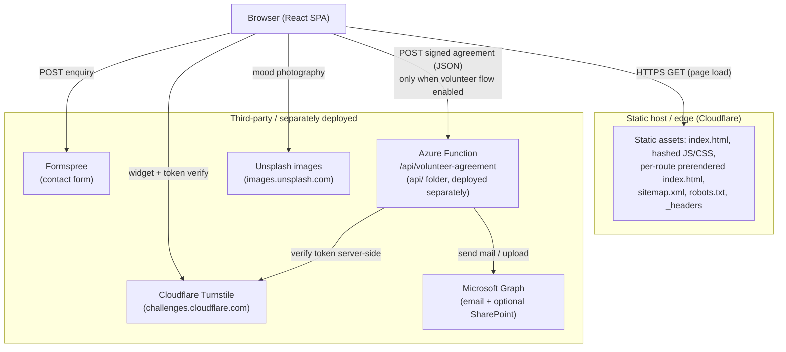

# Project Documentation

> Scope: this document describes the **`marrahub-oss`** repository — the public,
> open-source mirror of the MARRA Community Hub marketing website. It was written
> by reading the actual source and configuration, not just the README, and it
> flags places where the README and the code disagree.
>
> **Not covered here:** the separate "Marra Hub" SaaS product (the `hub` /
> `admin_hub` sibling folders). That is a different application; do not conflate
> it with this marketing website even though the names are similar.

---

## 1. Project overview

`marrahub-oss` is the website for **MARRA Community Hub**, a not-for-profit
community centre being established in Caulfield South (Glen Eira, Victoria,
Australia). The live site is **marrahub.com.au** (`README.md:5`,
`src/app/seo/site.ts:13`).

It is a **client-rendered React single-page application (SPA)** built with Vite,
with static SEO pre-rendering added at build time. Its purpose (per `README.md`
and the page content in `src/app/pages/`) is to present:

- community programs and future initiatives (`/programs`),
- impact and governance / transparency information (`/impact`, `/governance`),
- an "about" story and vision (`/about`),
- a contact / enquiry form (`/contact`), and
- a volunteer sign-up + digital agreement-signing flow (`/volunteer`) — **hidden
  in production behind a feature flag** (see §6, §10).

The repository also contains a **standalone backend** under `api/` — an Azure
Function that receives signed volunteer agreements — and **design-system sync
tooling** under `.design-sync/`. Neither is part of the website's own build or
Cloudflare deployment; both are documented in their respective sections below.

### Product identity note
The site brands itself as "MARRA Community Centre" / "MARRA Community Hub"
(`src/app/seo/site.ts:11-12`). This marketing site is **distinct** from the
"Marra Hub" SaaS application in the sibling `hub`/`admin_hub` folders. The one
real link between them is aspirational: several code comments describe the
volunteer-agreement feature as a portable "seam" intended to be lifted into "the
Hub SaaS" later (`api/README.md:184-185`, `src/app/features/volunteer-agreement/config.ts:4-6`,
`src/app/features/volunteer-agreement/submitAgreement.ts:5-7`).

---

## 2. Project architecture

### 2.1 Runtime architecture

The website is a static bundle served from a CDN/edge host. The browser runs the
React SPA. There is no application server for the website itself; the only
backend calls go to **third-party / separately-deployed** services:

- **Formspree** — receives the contact-form submission (`src/app/pages/Contact.tsx:7`).
- **Cloudflare Turnstile** — bot/spam challenge widget + token, used by both the
  contact form and the volunteer form (`src/app/pages/Contact.tsx:8`,
  `src/app/features/volunteer-agreement/useTurnstile.ts`).
- **Azure Function** (`api/`) — receives a signed volunteer agreement (only
  reached when the volunteer flow is enabled; disabled in production today).



### 2.2 Verified relationship to `marrahub-website` (the private production repo)

This was verified directly with `git`, not assumed:

- **Shared history.** `marrahub-oss` and the sibling `marrahub-website` share the
  same commit graph. `marrahub-website`'s `origin` is the private GitHub repo
  `Marra-Community-Hub-Incorporated/marrahub`, and it has a **second remote named
  `oss`** pointing at this public repo
  (`Marra-Community-Hub-Incorporated/marrahub-oss`). This repo's `origin` is the
  public `marrahub-oss` repo. (`git -C marrahub-website remote -v`,
  `git -C marrahub-oss remote -v`.)
- **They are currently at nearly the same commit.** `marrahub-website` HEAD =
  `c3e9809`. `marrahub-oss` `main` is also `c3e9809` (identical). The tracked
  file trees at that commit are **byte-for-byte identical** except that this
  repo's checked-out branch adds one further commit (see §2.3).
- **The difference is in *untracked / git-ignored* files, not tracked source.**
  The private `marrahub-website` working tree additionally carries files this
  public mirror does **not** have on disk:
  - real secret config: `.env.local`, `api/local.settings.json` (git-ignored);
  - extra design-system build artifacts / tooling directories: `.ds-sync/`,
    `ds-bundle/`, `.design-sync/compiled.css`, `.design-sync/.cache/` (all
    git-ignored — see §10.3).

  `marrahub-oss` has **no** secret files present (verified: `git status --ignored`
  is clean of them) — it ships only `.env.example`, `.env.production`
  (public values), and `api/local.settings.json.example`.

> **Correction to a common assumption.** It is sometimes stated that the public
> mirror is "sanitized" by having the Formspree contact form and analytics
> stripped out. That is **not** what the code shows. The Formspree contact form
> and the public Turnstile *site* key are present in **both** repos' tracked
> source (`src/app/pages/Contact.tsx:7-8`), by design — they are public
> client-side values. There is **no** web-analytics integration (no Google
> Analytics / Plausible / PostHog / gtag) in **either** repo's tracked source
> (verified by grep). The real "sanitization" is simply the absence of the
> git-ignored secret files and private design-build artifacts listed above.

### 2.3 Current branch / work in progress

- The checked-out branch is **`feat/home-redesign`** (`git branch`), which is
  **one commit ahead of `main`**: `6659707 "Redesign home page with aurora
  background and updated typography"`.
- That single commit touches `src/app/pages/Home.tsx` (largely rewritten),
  adds `src/app/components/AuroraBackground.tsx`, adds self-hosted brand fonts
  (`src/styles/fonts.css`), aurora keyframes (`src/styles/index.css`), and the
  `@fontsource/*` dependencies (`package.json`).
- The branch exists on `origin` (`remotes/origin/feat/home-redesign`) and the
  working tree is clean. It has **not** been merged to `main` and is **not** on
  the sibling `marrahub-website` HEAD yet. Treat the home redesign as
  **in-progress / under review**, not shipped.

---

## 3. Technologies used

| Area | Technology | Version (from `package.json`) | Notes |
|---|---|---|---|
| UI library | React + React DOM | 18.3.1 | Function components only |
| Routing | React Router | ^7.13.0 | `createBrowserRouter`, lazy/code-split routes (`src/app/routes.ts`) |
| Build tool | Vite | 6.4.3 (pinned) | `vite.config.ts` |
| Language | TypeScript | ~5.6 | `strict: true` (`tsconfig.json`) |
| Styling | Tailwind CSS | 4.1.12 | Via `@tailwindcss/vite`; tokens in `src/styles/theme.css` |
| Animation | Motion | 12.23.24 | `motion/react` (Framer Motion successor) |
| Icons | lucide-react | 0.487.0 | |
| Fonts | @fontsource Inter + Ibarra Real Nova | ^5.2.8 | Self-hosted (added on `feat/home-redesign`) |
| PDF generation | jsPDF | ^4.2.1 | Client-side, dynamically imported (`buildAgreementPdf.ts`) |
| Tailwind animation utils | tw-animate-css | 1.3.8 | |
| Edge/deploy tooling | Wrangler + `@cloudflare/vite-plugin` | wrangler ^4.105.0 | `wrangler.jsonc`, Cloudflare |
| Linting | ESLint + typescript-eslint | ^9.39.4 / ^8.62.1 | Flat config `eslint.config.js` |
| Formatting | Prettier | ^3.9.4 | `.prettierrc.json` |
| Spam protection | Cloudflare Turnstile | (external service) | Site key public; secret server-side only |
| Contact form | Formspree | (external service) | `https://formspree.io/f/xreavvnv` |
| **Backend (`api/`)** | Azure Functions v4, Node ≥20 | `@azure/functions` ^4.5.0 | Separate deploy; uses Microsoft Graph |

Node requirement for the website: **Node 18+** per README (`README.md:28`), though
CI builds on **Node 22** (`.github/workflows/ci.yml:45`) and the API requires
**Node 20+** (`api/package.json:14`).

---

## 4. File and folder structure

| Path | Purpose |
|---|---|
| `index.html` | SPA shell + build-time SEO `<head>` block (between `SEO_HEAD_START/END` markers) + inline SPA-redirect script (CSP-hashed) |
| `src/main.tsx` | App entry — mounts `<App/>` into `#root`, imports global CSS |
| `src/app/App.tsx` | Renders `<RouterProvider>` |
| `src/app/routes.ts` | Route table; every page lazy-loaded; conditional `/volunteer` route |
| `src/app/Layout.tsx` | Shared shell (Header + `<Outlet/>` + Footer + `<Seo/>`), scroll-to-top on route change |
| `src/app/featureFlags.ts` | `volunteer` flag (env-driven; ON in dev, OFF in prod by default) |
| `src/app/pages/` | Page components: `Home`, `About`, `Programs`, `Impact`, `Governance`, `Contact`, `NotFound` |
| `src/app/components/` | Presentational components: `Header`, `Footer`, `Button`, `SectionHeader`, `CTABanner`, `ProgramCard`, `ImpactCard`, `AuroraBackground`, `Seo` |
| `src/app/features/volunteer-agreement/` | Self-contained volunteer feature (form, PDF builder, signature pad, Turnstile hook, submit, config, types, agreement text) |
| `src/app/seo/site.ts` | Site config + per-route SEO metadata + canonical/URL helpers (runtime source of truth) |
| `src/styles/` | `index.css` (entry) → `fonts.css`, `tailwind.css`, `theme.css` (design tokens) |
| `scripts/seo-build.mjs` | Post-build: writes per-route prerendered `<head>`, JSON-LD, `sitemap.xml`, `robots.txt` |
| `public/` | Static passthrough: `_headers` (security + cache), `robots.txt`, `404.html` (SPA fallback), `media/` (images/favicons), `.well-known/security.txt`, `Marra_Hub_Volunteer_Agreement.pdf` |
| `api/` | Azure Function backend (volunteer agreement) — separate toolchain & deploy |
| `.design-sync/` | Design-system extraction tooling (dev/design aid; not in website build) |
| `docs/` | `CI.md`, `portal/SPEC.md` (draft future-portal spec), `portal/redesign-concept.html` (standalone mockup) |
| `guidelines/Guidelines.md` | Unfilled Figma Make template placeholder |
| `.github/workflows/ci.yml` | CI: secret scan + website build gate + API syntax check |
| `.env.example`, `.env.production` | Env var templates / public production values |
| `.gitleaks.toml` | Secret-scan config + allowlist for known public values |
| `wrangler.jsonc` | Cloudflare project config (`name: marrahub`, SPA asset handling) |
| `LICENSE`, `README.md`, `CONTRIBUTING.md`, `ATTRIBUTIONS.md` | MIT license + docs; attributions note the site was scaffolded from Figma Make (shadcn/ui, Unsplash) |

---

## 5. Running the project

### 5.1 Requirements
- **Node.js 18+** and npm (`README.md:28`). CI uses Node 22; the API folder needs
  Node 20+. Using Node 20/22 satisfies everything.
- No database, no `.env` file required for basic local dev — the volunteer
  feature has sensible localhost defaults (`config.ts:16-23`).

### 5.2 Installing dependencies
```bash
npm install
```
(The `api/` backend has its **own** dependencies: `cd api && npm install`.)

### 5.3 Environment variables

All browser-facing vars are prefixed `VITE_` and are **baked into the public
client bundle at build time** — never put a secret in one (`README.md:80-82`,
`.env.example:5`). Templates: `.env.example` (root) and
`api/local.settings.json.example` (backend). **No real secret values are
reproduced here; only names and purposes.**

**Website (`VITE_*`):**

| Variable | Purpose | Default if unset |
|---|---|---|
| `VITE_SITE_URL` | Canonical site origin; drives SEO metadata, canonical links & sitemap generation | `seo-build.mjs` skips `sitemap.xml` if unset; `.env.production` sets it to the live origin |
| `VITE_VOLUNTEER_API_URL` | Endpoint that receives signed volunteer agreements (the Azure Function URL) | `http://localhost:7071/api/volunteer-agreement` (`config.ts:16-18`) |
| `VITE_TURNSTILE_SITE_KEY` | Cloudflare Turnstile **site** key (public by design) | Falls back to the existing MARRA public site key (`config.ts:21-23`) |
| `VITE_VOLUNTEER_ENABLED` | Feature flag for the public volunteer flow (`/volunteer` page, nav link, CTAs) | Unset → ON in dev, OFF in production build (`featureFlags.ts:10-15`) |

**Backend (`api/`, from `api/local.settings.json.example`) — server-side; some are secrets:**

| Setting | Purpose |
|---|---|
| `TENANT_ID` | Microsoft Entra (Azure AD) directory/tenant ID |
| `CLIENT_ID` | App registration application (client) ID |
| `CLIENT_SECRET` | **Secret** — app registration client secret (Graph auth) |
| `GRAPH_SENDER` | Mailbox to send from (e.g. `hello@marrahub.com.au`) |
| `NOTIFY_RECIPIENT` | Where signed agreements are emailed (comma-separated allowed) |
| `TURNSTILE_SECRET` | **Secret** — Cloudflare Turnstile secret key (server-side verify); blank disables spam check locally |
| `ALLOWED_ORIGINS` | CORS allow-list for the function |
| `SHAREPOINT_ENABLED` / `SHAREPOINT_SITE_ID` / `SHAREPOINT_FOLDER` | Optional SharePoint filing of the PDF |
| `CONFIRMATION_EMAIL_ENABLED` | (Read in code) set to `"false"` to skip the volunteer thank-you email (`volunteerAgreement.js:92`) |

> **Safety:** the private `marrahub-website` repo contains a real
> `api/local.settings.json` and `.env.local` (git-ignored). Those hold live
> values. Do **not** copy real values into any documentation or the public repo;
> use the `.example` files as the reference for names/purposes only.

### 5.4 Running locally
```bash
npm run dev        # Vite dev server (hot reload); volunteer flow is ON in dev
```
Optional — to exercise the volunteer submission end-to-end, run the backend too:
```bash
cd api
cp local.settings.json.example local.settings.json   # fill in your own values
npm install
npm start          # Azure Functions host on http://localhost:7071
```
…and point the site at it via a root `.env.local` with
`VITE_VOLUNTEER_API_URL=http://localhost:7071/api/volunteer-agreement`
(`api/README.md:86-98`).

### 5.5 Running in production
```bash
npm run build      # vite build -> dist/, then node scripts/seo-build.mjs
npm run preview    # npm run build && wrangler dev  (serve the built output)
```
- **Build command:** `npm run build`; **output dir:** `dist` (`README.md:45-46`).
- Deployment is on **Cloudflare**. See §10.1 for a README/config discrepancy
  about *which* Cloudflare product and deploy mechanism.
- The `deploy` script exists: `npm run build && wrangler deploy`
  (`package.json:17`).

---

## 6. Backend

### 6.1 Main modules
The `api/` folder is a **functional, standalone Azure Function app** (Node,
Functions v4 programming model), not mere scaffolding — but it is **deployed
separately** from the website (to Azure), and the website only calls it when the
volunteer flow is enabled.

| File | Responsibility |
|---|---|
| `api/src/functions/volunteerAgreement.js` | HTTP-triggered function: validates the submission, verifies Turnstile, emails the signed PDF, optionally files it to SharePoint |
| `api/src/lib/graph.js` | Microsoft Graph helpers (OAuth2 client-credentials token; `sendMail` with PDF attachment; SharePoint upload) — no SDK, uses Node's global `fetch` |
| `api/src/lib/turnstile.js` | Server-side Turnstile token verification against Cloudflare siteverify |
| `api/host.json`, `api/package.json`, `api/.funcignore` | Functions host config + deps + deploy ignore |

### 6.2 API endpoints

| Method | Route | Auth | Purpose |
|---|---|---|---|
| `POST` | `/api/volunteer-agreement` | `anonymous` (Turnstile-gated) | Receive a signed volunteer agreement; email it (and optionally file to SharePoint) |
| `OPTIONS` | `/api/volunteer-agreement` | — | CORS preflight (returns 204 + CORS headers) |

Request body matches `VolunteerAgreementSubmission`
(`src/app/features/volunteer-agreement/types.ts:28-43`) — the website's source of
truth for the contract. Success: `200 { ok: true }`; failures return
`4xx/5xx { error: "..." }` (`api/README.md:180-182`).

### 6.3 Business logic (`volunteerAgreement.js`)
1. CORS handling; short-circuit `OPTIONS` (`:26-30`).
2. Parse JSON; reject invalid body (400) (`:32-37`).
3. Validate required string fields: `fullName, email, phone, area,
   emergencyContact, dietary, signedName, pdfBase64` (`:7-16`, `:39-43`).
4. Reject oversized attachment (>~8 MB base64 → 413) (`:19`, `:45-47`).
5. If `TURNSTILE_SECRET` is set, verify the token server-side; else skip
   (local-friendly) (`:49-56`).
6. Get a Graph app-only token (`getGraphToken`) (`:58-64`).
7. **Email the signed PDF** to `NOTIFY_RECIPIENT` (always) (`:73-86`).
8. **Confirmation email** to the volunteer with their PDF attached — non-fatal;
   a bounce must not fail the submission; skipped if
   `CONFIRMATION_EMAIL_ENABLED === "false"` (`:88-105`).
9. **Optional SharePoint upload** if `SHAREPOINT_ENABLED === "true"` — non-fatal
   (`:107-120`).
10. Return `200 { ok: true }` (`:122`).

### 6.4 Error handling
- Field/shape validation returns explicit 400/413 with an `error` message.
- Graph token failure → 500 "Server email configuration error." (`:61-64`).
- Primary email failure → 502 "Could not send the agreement email." (`:83-86`).
- Confirmation email and SharePoint upload failures are **caught and logged but
  not fatal** — the org has already received the record (`:102-104`, `:117-119`).
- The frontend `submitAgreement.ts` maps network failures and non-OK responses
  to user-friendly messages, preferring the server's `error` field.

### 6.5 Background tasks, workers, and queues
**None found.** The function is synchronous request/response. No timers, queues,
Durable Functions, or workers.

---

## 7. Frontend

### 7.1 Interface structure
- `Layout` wraps all routes with a sticky `Header`, a `<main>` `<Outlet/>`, and a
  `Footer`, plus a headless `<Seo/>` component; it scrolls to top on every route
  change (`Layout.tsx:11-24`).
- Routing is `createBrowserRouter` with **per-page lazy imports** so each page is
  a separate code-split chunk; `react`/`react-dom`/`react-router` are pinned into
  a long-lived `react-vendor` chunk (`vite.config.ts:17-19`).
- The `/volunteer` route is **conditional**: when the `volunteer` flag is on it
  renders the agreement page; when off, the route still exists but **redirects to
  `/contact`** so old links don't 404 (`routes.ts:8-16`).
- Deep links work on a static host via `public/404.html` (SPA redirect) + the
  inline un-redirect script in `index.html` (`index.html:105-119`), both allowed
  under CSP by an exact `sha256` hash (see §12).

### 7.2 Main components

| Component | File | Role / notable props |
|---|---|---|
| `Header` | `components/Header.tsx` | Sticky nav; nav items + CTA change with the `volunteer` flag; mobile menu (Motion) |
| `Footer` | `components/Footer.tsx` | Contact details, quick links, ABN, acknowledgement of country; Volunteer link gated by flag |
| `Button` | `components/Button.tsx` | Polymorphic: renders `<button>`, internal `<Link>`, or external `<a>` (http → new tab); `variant`/`size` |
| `SectionHeader` | `components/SectionHeader.tsx` | Eyebrow + serif title + description |
| `CTABanner` | `components/CTABanner.tsx` | Call-to-action banner, `default`/`muted` variants |
| `ProgramCard` | `components/ProgramCard.tsx` | Program tile with lucide icon + optional outcomes list |
| `ImpactCard` | `components/ImpactCard.tsx` | Stat/impact tile; shows icon or big number |
| `AuroraBackground` | `components/AuroraBackground.tsx` | Decorative animated colour wash (added in redesign); `aria-hidden`, honours `prefers-reduced-motion` |
| `Seo` | `components/Seo.tsx` | Headless; imperatively upserts `<title>`, meta, canonical, and JSON-LD on route change |

Volunteer feature (`src/app/features/volunteer-agreement/`):

| File | Role |
|---|---|
| `VolunteerAgreementPage.tsx` | The form UI + success screen |
| `SignaturePad.tsx` | Dependency-free canvas signature capture → PNG data URL |
| `buildAgreementPdf.ts` | Builds the signed PDF client-side (jsPDF, dynamically imported) |
| `agreementContent.ts` | The full agreement intro + 21 terms (transcribed from the official PDF) |
| `submitAgreement.ts` | The single network seam → `POST` to the configured endpoint |
| `useTurnstile.ts` | Loads/render Turnstile widget, exposes token/error/reset |
| `config.ts` / `types.ts` / `index.ts` | Env-driven config, the data contract, and the public barrel |

The pages (`About`, `Programs`, `Impact`, `Governance`, `Contact`) are large,
mostly **static content** components using the shared components + Motion for
entrance animations. `Contact` and the volunteer page are the only interactive
data-submitting pages.

### 7.3 Talking to the API
- **Contact form** posts a `multipart/form-data` payload directly to **Formspree**
  (`Contact.tsx:192-198`), including the Turnstile token as
  `cf-turnstile-response`. Formspree performs the Turnstile check on its side.
- **Volunteer form** builds the PDF in-browser, assembles a
  `VolunteerAgreementSubmission` JSON, and `POST`s it as `application/json` to
  `VITE_VOLUNTEER_API_URL` via `submitAgreement.ts`.
- Both flows load the Turnstile script from `challenges.cloudflare.com` and
  render the widget explicitly.

### 7.4 Application state
- **No global state library** (no Redux/Zustand/Context store). State is local
  React `useState`/`useRef` within `Contact` and the volunteer page.
- Routing state comes from React Router; SEO state is derived from
  `location.pathname` in the `Seo` component and `seo/site.ts`.

---

## 8. Database
**None.** There is no database in this repository — no schema, migrations, ORM,
or DB client. The website is static; the volunteer backend delivers records by
**email** (and optionally files a PDF into **SharePoint**) via Microsoft Graph.
Persistent volunteer/event storage is only described as a **future** idea in
`docs/portal/SPEC.md` (see §13), not implemented here.

---

## 9. Step-by-step project workflow (real visitor flow)

The sequence below shows the production reality: a visitor loads a page, then
submits the contact form (the volunteer flow is disabled in production, so its
CTA points at Contact).

```mermaid
sequenceDiagram
    participant U as Visitor (browser)
    participant CF as Cloudflare (static host)
    participant APP as React SPA
    participant TS as Cloudflare Turnstile
    participant FS as Formspree

    U->>CF: GET /programs
    CF-->>U: Prerendered index.html (SEO <head>) + hashed JS/CSS
    U->>APP: SPA boots, React Router renders the route
    APP->>APP: <Seo> updates title/meta/JSON-LD for the path
    Note over U,APP: Visitor navigates client-side (no full reloads);<br/>Layout scrolls to top on each change
    U->>APP: Open /contact, fill the form
    APP->>TS: Load widget, obtain Turnstile token
    TS-->>APP: token
    U->>APP: Submit
    APP->>FS: POST form data + cf-turnstile-response
    FS->>TS: Verify token (server-side, on Formspree)
    FS-->>APP: 200 OK (or error JSON)
    APP-->>U: Success or error message
```

When the volunteer flow **is** enabled, the `/volunteer` path instead renders the
agreement page; on submit it builds a PDF in-browser and `POST`s JSON to the
Azure Function, which verifies Turnstile server-side and emails the signed PDF.

---

## 10. Configuration

### 10.1 Deployment / hosting

- `README.md:43` says the site is "Hosted on **Cloudflare Pages**, which
  auto-deploys on every push to `main`."
- The actual config points at **Cloudflare's Workers-static-assets model via the
  Vite plugin**: `vite.config.ts` uses `@cloudflare/vite-plugin`
  (`vite.config.ts:5,9`); `wrangler.jsonc` defines `name: "marrahub"`,
  `assets.not_found_handling: "single-page-application"`, and
  `nodejs_compat`; and `package.json` provides `deploy: wrangler deploy` and
  `preview: wrangler dev`.
- **Disagreement to flag:** the README describes a Pages *auto-deploy on push*,
  while the repo also contains a Wrangler-based deploy path. Both are Cloudflare,
  but the "how it deploys" story is not internally consistent. Verify the live
  deployment mechanism before relying on either statement.

### 10.2 Security & cache headers (`public/_headers`)
Applied site-wide: HSTS (2y, preload), `X-Content-Type-Options: nosniff`,
`X-Frame-Options: DENY`, `Referrer-Policy: strict-origin-when-cross-origin`,
a restrictive `Permissions-Policy`, and a **Content-Security-Policy**. The CSP
allow-list matches what the app loads: Turnstile script/iframe, Formspree
(`connect-src` + `form-action`), the Azure Function host (`connect-src`),
Unsplash images (`img-src`), `data:` fonts, and the inline SPA-redirect script
by exact `sha256` hash. Hashed `/assets/*` are cached `immutable` for a year;
`/media/*` for a day with `stale-while-revalidate`.

### 10.3 Design-system sync tooling (`.design-sync/`)
This is a **development/design aid**, not part of the website build or runtime.
Its committed, durable inputs (`config.json`, `NOTES.md`, `conventions.md`,
`ds-entry.ts`, `ds-extras.tsx`, `brand-fonts.css`, `previews/`) configure a
"design-sync" converter that extracts the **7 visual components** (`Button`,
`CTABanner`, `Footer`, `Header`, `ImpactCard`, `ProgramCard`, `SectionHeader`)
into a portable design system (a `window.MarraHub.*` bundle) so a design agent
can compose pages against them. Because this is a Vite app (not a published
component library), it uses a **synthetic barrel** (`ds-entry.ts`) and
**hand-written prop contracts** (`config.json` → `dtsPropsFor`) that must be kept
in sync manually when a component changes (`.design-sync/NOTES.md:6-7`).

The tool's **generated/machine-local outputs are git-ignored** and are **absent
from this public mirror**: `.design-sync/compiled.css`, `.design-sync/.cache/`,
`.design-sync/learnings/`, `.ds-sync/`, and `ds-bundle/` (`.gitignore`). Those
directories **do** exist in the private `marrahub-website` working tree. In
other words, this repo carries the design-sync *recipe* but not its *built
artifacts* — which is expected and harmless, but see §13 for the drift risk.

### 10.4 Lint / format / TypeScript
- **ESLint** flat config (`eslint.config.js`): `@eslint/js` + `typescript-eslint`
  recommended + react-hooks + react-refresh; **ignores** `dist`, `node_modules`,
  `api`, `scripts`, `.design-sync`, `.ds-sync`, `ds-bundle` (they have their own
  or no toolchain). `eslint-config-prettier` last to disable conflicting rules.
- **Prettier** (`.prettierrc.json`): single quotes, semicolons, trailing commas
  `all`, print width 80.
- **TypeScript** (`tsconfig.json`): `strict: true`, bundler module resolution,
  `noEmit` (Vite compiles; `tsc` only type-checks). Unused-var detection is left
  to ESLint (as warnings), by design.

---

## 11. Testing
**No test suite found.** There are no `*.test.*` / `*.spec.*` files and no test
runner (Vitest/Jest) in `package.json`. "Testing" in this project means the CI
gates in §12 (type-check, lint, production build, API syntax check, secret scan)
plus manual browser verification described in `CONTRIBUTING.md:20-23`.

---

## 12. Diagnostics and troubleshooting

| Symptom | Likely cause | Where to look / fix |
|---|---|---|
| Deep links (e.g. `/programs`) 404 or the SPA redirect breaks | Inline SPA-redirect script edited without recomputing its CSP `sha256` hash | Recompute the hash after `npm run build` and update `public/_headers` (`CONTRIBUTING.md:48-62`) |
| A newly added script/image/font/API is blocked in the browser | New external origin not added to the matching CSP directive | Update `Content-Security-Policy` in `public/_headers` |
| `sitemap.xml` not generated; robots has no `Sitemap:` line | `VITE_SITE_URL` unset at build time | Set `VITE_SITE_URL` (or use `.env.production`) — `seo-build.mjs:387-395` |
| `/volunteer` unexpectedly redirects to `/contact` | Volunteer flow disabled (production default) | Set `VITE_VOLUNTEER_ENABLED=true` and rebuild (`featureFlags.ts`, `.env.production:13`) |
| Volunteer submit fails with "Could not reach the server" | `VITE_VOLUNTEER_API_URL` wrong, or the Azure Function/CORS/Turnstile misconfigured | Check the URL, the function's `ALLOWED_ORIGINS`, and `TURNSTILE_SECRET` (`submitAgreement.ts`, `api/`) |
| Turnstile widget won't load on `localhost` | localhost not in the Turnstile widget's allowed hostnames | Add localhost in Cloudflare, or leave the backend `TURNSTILE_SECRET` blank for local testing (`api/README.md:100-104`) |
| CI fails on "Secret scan" | A real secret committed anywhere in history | Rotate it; the gitleaks allowlist only exempts known public values (`.gitleaks.toml`) |
| Fonts render as Georgia/system | Brand fonts not loaded | On `feat/home-redesign` they're self-hosted via `@fontsource` (`src/styles/fonts.css`); on older `main`, `fonts.css` was empty (see §13) |
| Structured-data phone numbers differ between the shell and runtime | `seo-build.mjs` duplicates `siteConfig` and lists two phones vs one in `seo/site.ts` (see §13) | Reconcile the two `siteConfig` copies |

---

## 13. Weak points and recommendations

**High priority**

- **Duplicated, drifting `siteConfig` for SEO.** `scripts/seo-build.mjs:18-36`
  hardcodes its own copy of the site config used to generate the prerendered
  `<head>` and JSON-LD, instead of importing `src/app/seo/site.ts`. They have
  **already drifted**: `seo-build.mjs` lists two phone numbers
  (`+61421803285`, `+61433212855`) while the runtime `seo/site.ts:21` lists one
  (`+61433212855`). Search engines see the prerendered version; users after
  hydration see the runtime version. *Recommendation:* make the build script
  import the single source of truth (or generate one from the other) so they
  cannot diverge.
- **Fork/mirror drift risk (public vs private).** This public repo and the
  private `marrahub-website` share history but are maintained as two remotes
  (§2.2). It is easy for a change (a secret, a private-only tweak, or an
  unmerged branch like `feat/home-redesign`) to land in one and not the other.
  *Recommendation:* define and document a one-way sync process (which repo is
  authoritative, how commits flow public↔private) and keep the secret-scan CI as
  the guardrail that prevents private values leaking into the public mirror.
- **Contributor onboarding points at an inaccessible repo.** `CONTRIBUTING.md:11`
  and `package.json:9-11` reference the **private** `marrahub.git` for cloning,
  but external contributors only have `marrahub-oss`. *Recommendation:* update
  the public repo's clone URL to `marrahub-oss`.

**Medium priority**

- **Deployment docs vs config mismatch** (§10.1) — README says Cloudflare Pages
  auto-deploy; config uses the Cloudflare Vite plugin + `wrangler deploy`.
  Reconcile so a new developer knows the real path.
- **Stale design-sync notes.** `.design-sync/NOTES.md:14-16` states brand fonts
  are "not shipped by the repo" and the live site "falls back to Georgia/system."
  That is no longer true on `feat/home-redesign`, which self-hosts Inter + Ibarra
  Real Nova via `@fontsource` (`src/styles/fonts.css`). Update NOTES.md when the
  redesign merges.
- **No automated tests.** There is no unit/integration/e2e coverage for the two
  interactive flows (contact, volunteer) or the SEO build script. Even a couple
  of tests around `seo-build.mjs` (marker upsert, sitemap gating) and the
  volunteer submission contract would catch regressions the build gate cannot.
- **`api/README.md` CSP guidance mentions Formspree in `connect-src`** for the
  volunteer function example (`api/README.md:151`), which is unrelated to that
  endpoint; harmless but potentially confusing.

**Low priority**

- **`guidelines/Guidelines.md` is an empty template.** It still contains the
  Figma Make placeholder ("Add your own guidelines here") and a commented-out
  example — it provides no real guidance. Either fill it in or remove it.
- **`api/local.settings.json.example` contains a real-looking recipient email.**
  It ships `NOTIFY_RECIPIENT: "volodymyr.gor@marrahub.com.au"` and
  `GRAPH_SENDER: "hello@marrahub.com.au"` as example values — not secrets, but
  consider genericizing in a public example file.
- **`docs/portal/redesign-concept.html` (710 lines) and `docs/portal/SPEC.md`
  are aspirational.** The SPEC is an explicitly **DRAFT** design for a future
  full "Volunteer Portal" (Entra External ID auth, Azure Container Apps API,
  Azure SQL, Graph email) that is **not implemented** in `src/`
  (`docs/portal/SPEC.md:1-2`); the HTML is a **standalone concept mockup** not
  referenced by the build. Keep them clearly labelled as plans/mockups so they
  aren't mistaken for shipped features.

---

## 14. Quick start for a new developer

```bash
# 1. Clone the public mirror
git clone https://github.com/Marra-Community-Hub-Incorporated/marrahub-oss.git
cd marrahub-oss

# 2. Install and run the site (Node 18+/20+)
npm install
npm run dev            # http://localhost:5173 ; volunteer flow is ON in dev

# 3. (Optional) run the volunteer backend to test end-to-end
cd api
cp local.settings.json.example local.settings.json   # fill in YOUR values
npm install
npm start              # http://localhost:7071/api/volunteer-agreement
# then, in the site, add a root .env.local with:
#   VITE_VOLUNTEER_API_URL=http://localhost:7071/api/volunteer-agreement

# 4. Before opening a PR (mirror the CI gates)
npm run typecheck
npm run lint
npm run build          # must succeed; also generates SEO output into dist/
npm run preview        # sanity-check the built site (wrangler dev)
```

Notes for newcomers:
- Work on a branch off `main` and open a PR (`CONTRIBUTING.md`). Pushing to
  `main` triggers a Cloudflare production deploy.
- Keep pages **lazy-loaded** in `routes.ts`; style with **Tailwind tokens** from
  `src/styles/theme.css` — never hard-coded hex.
- **Never commit secrets.** `VITE_*` values are public and ship in the bundle.
  The gitleaks CI scan blocks accidental secret commits.
- If you edit the inline SPA-redirect script in `index.html`, recompute its CSP
  hash (see §12 / `CONTRIBUTING.md`).

---

## 15. File ownership map

There is no `CODEOWNERS` file. Ownership below is **inferred** from code
comments, `docs/portal/SPEC.md` ("Owner: dev (Volodymyr)"), and structure — treat
it as a maintenance map, not a formal assignment.

| Area / files | Concern | Change with care because… |
|---|---|---|
| `src/app/pages/*`, `src/app/components/*` | Marketing UI & content | Public-facing copy and layout; content is community/organisation-owned |
| `src/app/features/volunteer-agreement/*` | Volunteer flow & data contract | `types.ts` is the shared contract with the backend; designed as a portable "seam" |
| `api/*` | Volunteer backend (Azure) | Touches secrets, Microsoft Graph, and PII (signed agreements); deployed separately |
| `src/app/seo/site.ts` + `scripts/seo-build.mjs` | SEO metadata & structured data | Two copies of `siteConfig` — keep in sync (§13) |
| `public/_headers` | Security & caching | CSP changes can silently break the site (deep links, external calls) |
| `.github/workflows/ci.yml`, `.gitleaks.toml`, `docs/CI.md` | CI / security pipeline | The guardrail that keeps secrets out of the public repo |
| `.design-sync/*` | Design-system sync tooling | Hand-maintained prop contracts; dev/design aid, not shipped |
| `docs/portal/*` | Future portal spec & mockup | Plans, not implementation — don't treat as shipped |
| `wrangler.jsonc`, `vite.config.ts`, `.env.production` | Build & deploy config | Affects how/where the site ships |

---

## 16. Summary

`marrahub-oss` is the **public, MIT-licensed mirror** of the MARRA Community Hub
marketing website: a React 18 + Vite 6 + TypeScript SPA, styled with Tailwind
CSS 4, routed with React Router 7 (lazy/code-split), animated with Motion, and
deployed as a static bundle on Cloudflare with build-time SEO pre-rendering
(`scripts/seo-build.mjs`). It has **no database**; dynamic behaviour is limited
to a Formspree contact form and a Turnstile-protected **volunteer-agreement**
flow whose backend is a **separately-deployed Azure Function** (Microsoft Graph
email + optional SharePoint) under `api/`. That volunteer flow is **disabled in
production** today via `VITE_VOLUNTEER_ENABLED=false` (the `/volunteer` route
redirects to `/contact`).

It shares git history with the private production repo `marrahub-website` (linked
by that repo's `oss` remote); tracked source is essentially identical, and the
"public vs private" difference is the **absence of git-ignored secret files and
private design-build artifacts** here — not stripped features. The repo is
currently on the unmerged **`feat/home-redesign`** branch (one commit ahead of
`main`: the aurora-background home redesign + self-hosted brand fonts), which
should be treated as work-in-progress. The most important maintenance risk is
**configuration drift** — both the duplicated SEO `siteConfig` (already diverged
on phone numbers) and the broader public/private fork relationship — which the
secret-scanning CI helps contain but does not fully solve.
